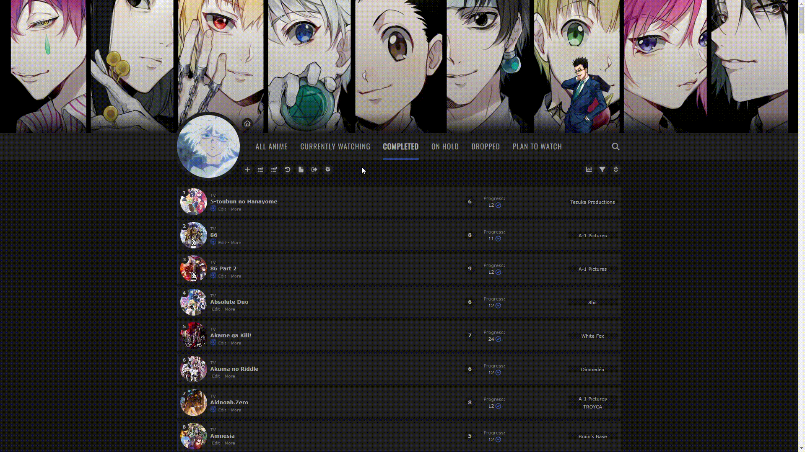

# MyAnimeList Theme 🎨

> CSS layout for MyAnimeList with Hunter x Hunter theme 💚

## ⚙ Installation
### To apply this theme, follow the instructions below:
- Navigate to your [Account Settings](https://myanimelist.net/editprofile.php?go=myoptions) > [List Style Design](https://myanimelist.net/ownlist/style).
- Ensure that the `Modern` template is enabled.
- Go to [Add Custom CSS](https://myanimelist.net/ownlist/style/theme/9) paste the contents of `main.css` into that new style and click save.

## 📷 Images

[🔗 Killua Avatar ⚡](https://i.pinimg.com/originals/79/b1/ba/79b1ba775e3e72925b835b7fdf3edb2d.gif)

[🔗 Banner Genei Ryodan 🕷 with Gon 💚/ Killua ⚡/ Kurapika ⛓](https://images8.alphacoders.com/856/thumb-1920-856893.png)

[🔗 Leorio 💼](https://i.pinimg.com/originals/6b/90/2a/6b902a75e2f6b0b60123f72eb135895b.png)

[🔗 Click here to access my list 🌸](https://myanimelist.net/animelist/brunakarina)
